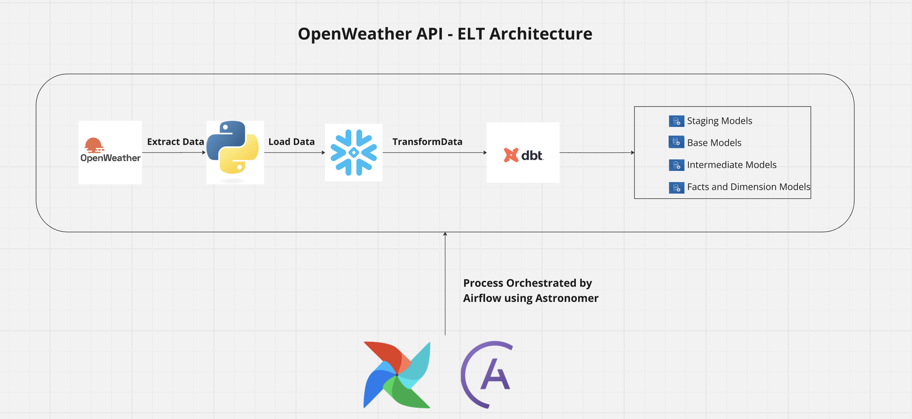
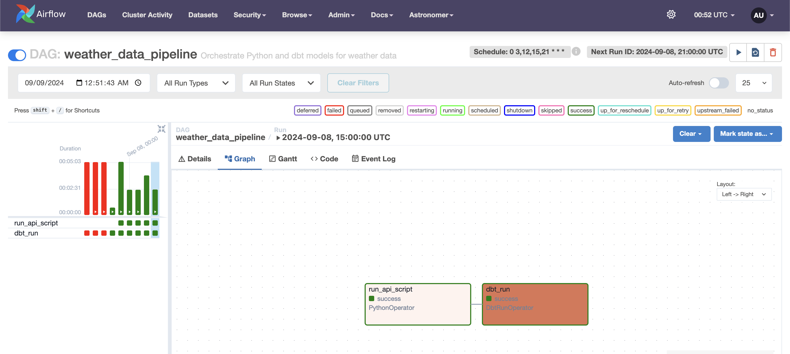
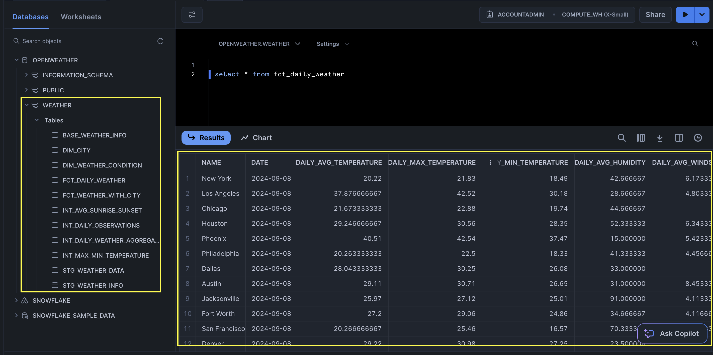
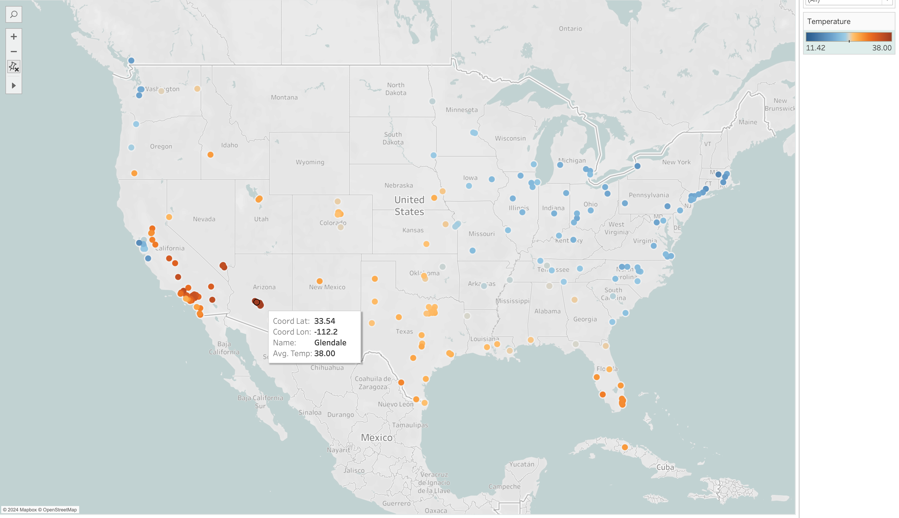

# Weather Data Pipeline Project 🌤️

This project is designed to extract weather data from the OpenWeatherMap API, transform the data using dbt models, and orchestrate the entire process using Apache Airflow. The pipeline ingests weather data for multiple cities and stores it in Snowflake for further analysis and reporting.

---

## 📋 Table of Contents

1. [Project Overview](#project-overview)
2. [Architecture Diagram](#Architecture-diagram)
3. [Technologies Used](#technologies-used)
4. [Project Structure](#project-structure)
5. [dbt Models](#dbt-models)
6. [Screenshots](#screenshots)
   - Airflow DAG
   - Snowflake
   - Tableau
---

## 🚀 Project Overview

This project collects real-time weather data in 4 time intervals throughout a 24hr period for 200 cities using the OpenWeatherMap API and loads the data into a Snowflake database. The data is processed using a series of dbt models to extract insights and support analytics. Airflow orchestrates the pipeline by scheduling and running the data extraction and transformation steps at predefined intervals. Since I'm using free version of Snowflake DW I've set a limit of 200 US cities for data retrieval.

---

## 🖥️ Architecture Diagram


---

## 🛠️ Technologies Used

- **Apache Airflow**: For orchestrating the data pipeline.
- **Astronomer**: a managed orchestration platform built on Airflow, to simplify managing and scaling the entire data pipeline workflow, offering broader capabilities compared to Cosmos, which focuses specifically on dbt integration
- **dbt (Data Build Tool)**: For transforming raw weather data into clean models in Snowflake.
- **Snowflake**: The cloud data warehouse where the weather data is stored and transformed.
- **OpenWeatherMap API**: The API providing real-time weather data.
- **Docker & Docker Compose**: Containerizing and managing the project.
- **Python**: For the custom script to fetch weather data.
  
---

## 📁 Project Structure

The main components of the project are structured as follows:

```plaintext
Data_Pipeline_Project/
│
├── OpenWeather/
│   ├── Dockerfile               # Dockerfile for setting up the environment
│   ├── dags/
│   │   ├── OpenWeather/         # Subdirectory under dags for all DAGs related to OpenWeather
│   │   │   ├── dbt_weather_dag.py  # Airflow DAG for orchestrating the dbt pipeline
│   │   │   ├── API_Call.py         # Python script to extract weather data from the API
│   ├── dbt_project.yml         # dbt project configuration file for Snowflake
│   ├── profiles.yml            # dbt profiles file for Snowflake
│   ├── models/                 # dbt models directory for transforming data
│   ├── requirements.txt        # Python dependencies file
│   ├── logs/                   # Logs generated during pipeline runs
│   ├── include/                # Include directory for additional dbt configurations
│   ├── macros/                 # Macros used in dbt transformations
│   ├── seeds/                  # Seed files for dbt
│   ├── snapshots/              # Snapshots directory for dbt
│   ├── target/                 # Compiled dbt models and transformations
│   ├── tests/                  # Test cases for dbt models
│
├── docker-compose.yml          # Docker Compose file for orchestrating services
└── README.md                   # Project documentation (to be published on GitHub)
```
---

## 🗄️ dbt models

1. Staging Models:

   - **stg_weather_info.sql**

   This model contains all data fields from the API for all 200 cities.

2. Base Models:

   - **base_weather_info.sql**
  
3. Intermediate Models:

   - int_avg_sunrise_sunset.sql
   - int_daily_observations.sql
   - int_daily_weather_aggregates.sql
   - int_max_min_temperature.sql
   - int_weather_count.sql

4. Fact Models:

   - fct_daily_weather.sql
   - fct_weather_with_city.sql
  
5. Dimension Models:

   - dim_city.sql
   - dim_weather_condition.sql

---

📸 Screenshots

- Airflow DAGS



- Snowflake



- Tableau



  
